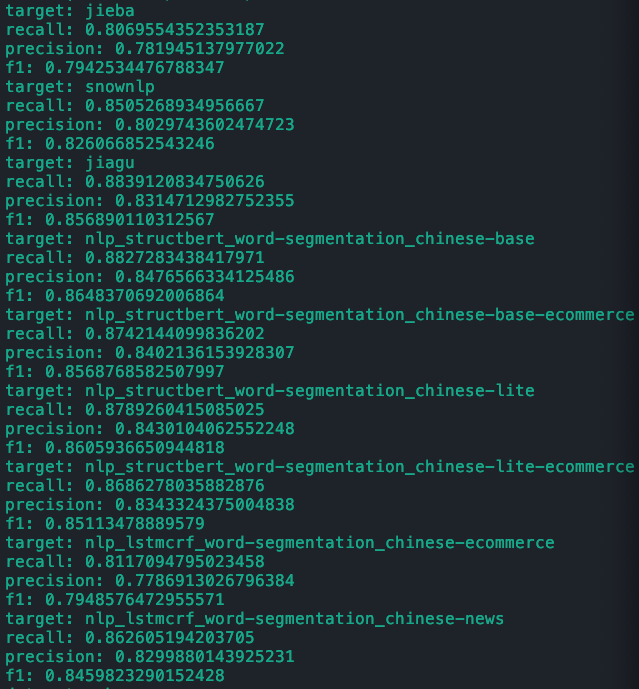
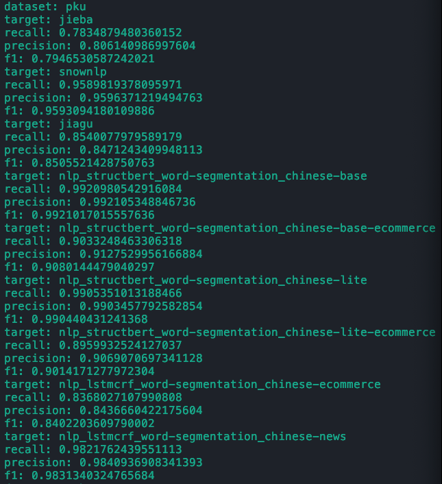
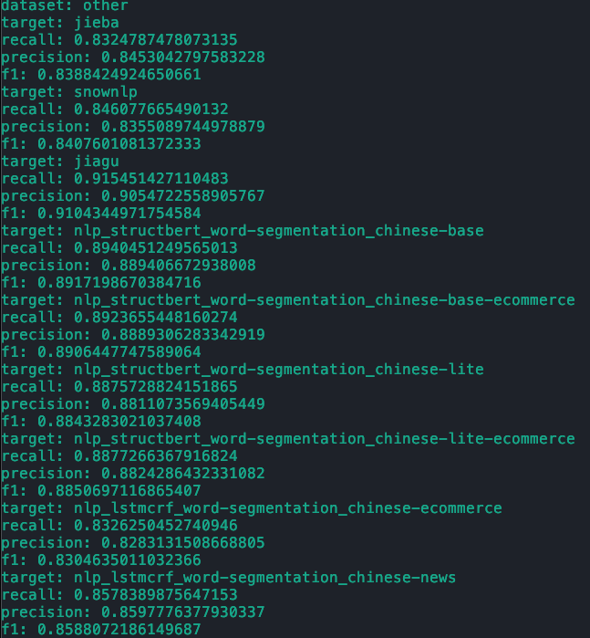

# cws-evaluation
测试多种中文分词算法的性能

# 使用方法
在`props/`下更改对应的yaml文件, 然后运行
```
python main.py
```
注意, 如果需要使用神经网络模型, 则需要提前下载好models中对应的模型文件, 并将模型文件放在yaml文件中path的路径下.
模型文件的下载地址为: www.modelscope.cn

# 测试结果
Models:
- jieba
- snownlp
- jiagu
- bert-b: nlp_structbert_word-segmentation_chinese-base
- bert-be: nlp_structbert_word-segmentation_chinese-base-ecommerce
- bert-l: nlp_structbert_word-segmentation_chinese-lite
- bert-le: nlp_structbert_word-segmentation_chinese-lite-ecommerce
- lstm-e: nlp_lstmcrf_word-segmentation_chinese-ecommerce
- lstm-n: nlp_lstmcrf_word-segmentation_chinese-news
## MSR
| Algo    | Precision  | Recall | F1         |
|---------|------------|--------|------------|
| jieba   | 0.7819     | 0.8070 | 0.7943     |
| snownlp | 0.8030     | 0.8505 | 0.8260     |
| jiagu   | 0.8315     | **0.8839** | 0.8569     |
| bert-b  | **0.8477** | 0.8827 | **0.8648** |
| bert-be | 0.8402     | 0.8742 | 0.8569     |
| bert-l  | 0.8430     | 0.8789 | 0.8606     |
| bert-le | 0.8343     | 0.8686 | 0.8511     |
| lstm-e  | 0.7786     | 0.8117 | 0.7949     |
| lstm-n  | 0.8300     | 0.8626 | 0.8460     |

## PKU
部分神经网络模型使用PKU数据集训练, 因此这一部分中几个模型的数据并不具有参考价值.

| Algo    | Precision | Recall | F1     |
|---------|-----------|--------|--------|
| jieba   | 0.8061    | 0.7835 | 0.7947 |
| snownlp | 0.9590    | 0.9590 | 0.9593 |
| jiagu   | 0.8471    | 0.8540 | 0.8506 |

## OTHER
| Algo    | Precision | Recall | F1     |
|---------|-----------|--------|--------|
| jieba   | 0.8453    | 0.8325 | 0.8388 |
| snownlp | 0.8355    | 0.8461 | 0.8408 |
| jiagu   | 0.9055    | 0.9155 | 0.9104 |
| bert-b  | 0.8894    | 0.8940 | 0.8917 |
| bert-be | 0.8889    | 0.8924 | 0.8906 |
| bert-l  | 0.8811    | 0.8876 | 0.8843 |
| bert-le | 0.8824    | 0.8877 | 0.8851 |
| lstm-e  | 0.8283    | 0.8326 | 0.8305 |
| lstm-n  | 0.8598    | 0.8326 | 0.8588 |

